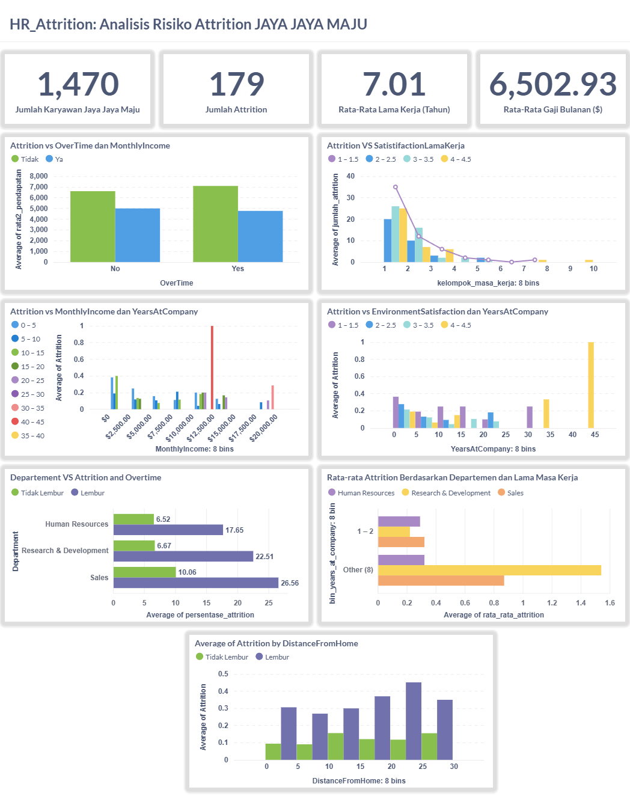

# Proyek Akhir: Menyelesaikan Permasalahan Perusahaan Jaya Jaya Maju

## Business Understanding

Jaya Jaya Maju merupakan salah satu perusahaan multinasional yang telah berdiri sejak tahun 2000. Ia memiliki lebih dari 1000 karyawan yang tersebar di seluruh penjuru negeri. 

Walaupun telah menjadi menjadi perusahaan yang cukup besar, Jaya Jaya Maju masih cukup kesulitan dalam mengelola karyawan. Hal ini berimbas tingginya attrition rate (rasio jumlah karyawan yang keluar dengan total karyawan keseluruhan) hingga lebih dari 10%.

Untuk mencegah hal ini semakin parah, manajer departemen HR ingin meminta bantuan mengidentifikasi berbagai faktor yang mempengaruhi tingginya attrition rate dan  membuat business dashboard untuk membantunya memonitoring berbagai faktor tersebut. 

### Permasalahan Bisnis

- Proyek ini bertujuan untuk mengatasi tantangan dalam retensi karyawan dengan menganalisis faktor-faktor yang mempengaruhi attrition rate di perusahaan. Beberapa aspek utama yang diperhatikan meliputi demografi karyawan, tingkat kepuasan kerja, serta indikator finansial.
- Selain itu, proyek ini juga berfokus pada evaluasi kepuasan karyawan berdasarkan sejumlah parameter penting seperti Job Satisfaction, Work-Life Balance, dan Environment Satisfaction. Dengan memahami pola perilaku karyawan yang cenderung keluar—misalnya dampak dari jarak rumah ke kantor, intensitas lembur (OverTime), serta tingkat pendapatan—perusahaan dapat mengambil langkah yang lebih efektif untuk meningkatkan retensi.
- Sebagai solusi, proyek ini juga menyediakan business dashboard yang memungkinkan tim HR memantau dan menganalisis faktor penyebab attrition secara berkala, sehingga strategi dapat disusun dengan lebih tepat sasaran. 

### Cakupan Proyek

Proyek ini mencakup:
- Eksplorasi data kepegawaian perusahaan.
- Visualisasi dashboard interaktif menggunakan Metabase.
- Penerapan model prediktif (Logistic Regression dan Decision Tree) untuk mengidentifikasi faktor penyebab attrition.
- Evaluasi performa model dan interpretasi terhadap variabel yang paling memengaruhi keputusan karyawan untuk keluar.
- Memberikan rekomendasi praktis terkait isu retention dari hasil analisis data 


## Persiapan

1. Eksplorasi dan pemahaman data kepegawaian ([employee_data.csv](https://github.com/dicodingacademy/dicoding_dataset/tree/main/employee)).
2. Pembersihan dan transformasi data.
3. Pembuatan dashboard interaktif menggunakan **Metabase**.
4. (Opsional) Modeling prediktif untuk mengetahui probabilitas attrition.


#### Cara Menjalankan Proyek:
1. Install library:
```bash
pip install -r requirements.txt
``` 
2. Jalankan Notebook
   Gunakan Google Colab atau Jupyter Notebook untuk membuka `notebook.ipynb` dan eksekusi cell dari atas ke bawah.
3. Menjalankan Dashboard
      Untuk melihat isi dashboard secara langsung, dapat menggunakan **metabase** dengan bantuan Docker (pastikan Docker sudah terinstall).
   - Jalankan perintah berikut:
      ```
      docker pull metabase/metabase:v0.46.4
      ```
   - Jalankan container Metabase menggunakan perintah:
      ```
      docker run -p 3000:3000 --name metabase metabase/metabase
      ```
   - Login ke Metabase menggunakan username dan password berikut:
      ```
      username: root@mail.com
      password: root123
      ```
---

## 📊 Business Dashboard

Dashboard ini dibuat untuk memudahkan tim HR memahami perilaku karyawan yang keluar dari perusahaan dan mengambil langkah strategis berbasis data.

Hasil dari **Business Dashboard** adalah sebagai berikut:




Rangkuman Visualisasi:
1. Kartu KPI:
   - Jumlah Karyawan : 1,470
   - Jumlah attrition: 179
   - Rata-rata lama kerja: 7.01 tahun
   - Rata-rata gaji: $6.502

2. Attrition vs OverTime & Income:
   - Lembur dan gaji rendah memperbesar kemungkinan keluar.

3. Attrition vs Environment Satisfaction & Years at Company:
   - Kepuasan rendah + kerja <3 tahun berisiko tinggi.

4. Attrition vs Department & Overtime:
   - Divisi Sales dan R&D dominan attrition, khususnya karyawan lembur.

5. Attrition vs Distance From Home:
   - Jarak rumah >10 km meningkatkan risiko keluar jika dikombinasikan dengan lembur.

6. Attrition vs Job Satisfaction & OverTime:
   - Job Satisfaction rendah + lembur meningkatkan kemungkinan resign.

---

## 🔍 Pendekatan Prediktif (Opsional)

Sebagai eksperimen, dilakukan modeling klasifikasi untuk menguji kemampuan memprediksi karyawan yang berpotensi keluar (attrition) berdasarkan atribut seperti lembur, pendapatan, dan peran kerja.

| Model               | Akurasi | Recall (Attrition) | Precision (Attrition) |
|--------------------|--------:|--------------------:|-----------------------:|
| Logistic Regression| 90%     | 25%                 | 75%                    |
| Decision Tree      | 80%     | 31%                 | 24%                    |

**Insight Tambahan:**
- Logistic Regression menunjukkan akurasi keseluruhan yang baik namun lemah dalam mengenali kelas minoritas (Attrition).
- Decision Tree lebih eksploratif dan mengungkap _OverTime_ serta _MonthlyIncome_ sebagai fitur paling berpengaruh.
- Kinerja rendah terhadap prediksi attrition menunjukkan **perlu adanya balancing atau fitur tambahan**.

---

## 🎯 Kesimpulan

Berdasarkan analisis yang telah dilakukan terhadap data karyawan Jaya Jaya Maju, ditemukan bahwa attrition karyawan dipengaruhi oleh kombinasi beberapa faktor.

1.  Karakteristik Umum Karyawan yang Attrition:
   - Memiliki **masa kerja kurang dari 3 tahun**.
   - Sering melakukan **lembur (OverTime = Yes)**.
   - **Gaji bulanan berada di kelompok menengah ke bawah**.
   - Tingkat **kepuasan terhadap lingkungan kerja rendah** (EnvironmentSatisfaction < 3).

2. Karakteristik Khusus:
   - Paling banyak berasal dari **Departemen Sales** dan **Research & Development**.
   - Berasal dari **jarak rumah yang jauh (lebih dari 10 km)** dan tetap harus bekerja lembur
   - Berada pada jabatan seperti **Sales Executive** dan **Laboratory Technician** dengan tekanan dan turnover tinggi.

4. Alasan Berdasarkan Data:
   - Karyawan dengan **lembur** memiliki tingkat attrition hampir **2–3 kali lipat** lebih tinggi dibandingkan yang tidak lembur.
   - Tingkat attrition tertinggi terjadi pada kombinasi **masa kerja pendek dan gaji tidak kompetitif**.
   - **Kepuasan lingkungan kerja** yang rendah juga memperburuk keinginan karyawan untuk bertahan di perusahaan.
   - Visualisasi multivariat memperkuat bahwa **attrition adalah hasil dari tekanan kerja, kompensasi, dan kepuasan kerja yang saling berkaitan.**

Dashboard yang dibangun memungkinkan tim HR untuk secara proaktif mengidentifikasi dan memantau kelompok karyawan berisiko tinggi, serta menyusun kebijakan retensi berbasis data yang lebih tepat sasaran.

---

## ✅ Rekomendasi Strategis

Berdasarkan insight dari dashboard dan analisis prediktif, berikut beberapa rekomendasi untuk menurunkan attrition di Jaya Jaya Maju:

1. **Kurangi Lembur Berlebihan**  
   Terapkan kebijakan pembatasan lembur, terutama untuk divisi Sales dan R&D yang menunjukkan attrition tertinggi. Jadwalkan rotasi lembur yang lebih adil dan insentifkan efisiensi.

2. **Tingkatkan Kompensasi untuk Karyawan Baru**  
   Attrition tinggi terjadi pada masa kerja < 3 tahun dan pendapatan menengah ke bawah. Pertimbangkan penyesuaian gaji awal dan percepatan kenaikan berdasarkan performa.

3. **Perkuat Program Onboarding dan Retensi Awal**  
   Implementasi mentoring dan pelatihan pengembangan karier sejak awal masuk kerja dapat memperkuat loyalitas.

4. **Monitoring Kepuasan Kerja secara Rutin**  
   Jalankan survei internal dan forum feedback untuk mengukur Environment Satisfaction. Tindak lanjuti skor rendah dengan program peningkatan kenyamanan kerja.

5. **Fleksibilitas untuk Karyawan Jarak Jauh**  
   Berikan opsi kerja hybrid atau subsidi transportasi bagi karyawan dengan jarak rumah > 10 km, khususnya yang lembur.

6. **Gunakan Dashboard Secara Berkala**  
   Dashboard harus dimanfaatkan sebagai alat pemantauan aktif oleh tim HR untuk mendeteksi gejala attrition lebih awal dan menyesuaikan strategi personalia secara real-time.

---
